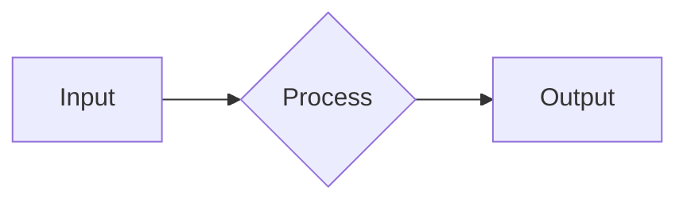

## 1. 개요 (Introduction)

이 블로그는 vs code의 템플릿을 테스트하기 위해서 작성된 글입니다

---

## 2. 이론적 배경 (Methodology)
안녕하세요 김우진입니다

### 2.1 수학적 모델링

$$
E = mc^2
$$

---

## 3. 구현 (Implementation)

### 3.1 시스템 구조도


### 3.2 핵심 코드
```python
# 여기에 코드를 붙여넣으세요
def robot_control():
    pass
```

---

## 4. 결과 및 고찰 (Results & Discussion)


---

## 5. 결론 (Conclusion)

* 
* 
* 

---
**Reference**
* [Google](https://google.com)