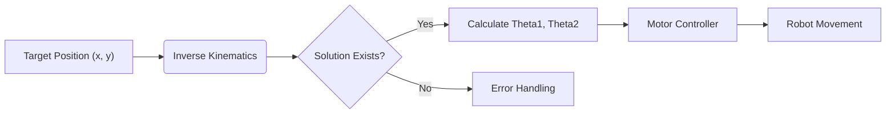

## 1. 개요 (Introduction)

로봇 팔을 제어하기 위해서는 작업 공간(Task Space)의 좌표 $(x, y)$를 관절 공간(Joint Space)의 각도 $(\theta_1, \theta_2)$로 변환해야 합니다. 이를 **역기구학(Inverse Kinematics, IK)** 이라고 합니다.

이 포스트에서는 기하학적 접근을 통해 2-Link Planar Arm의 해를 구하고, 이를 파이썬으로 시각화해 봅니다.

---

## 2. 수학적 모델링 (Mathematical Modeling)

### 2.1 코사인 법칙 활용

제 2관절의 각도 $\theta_2$는 **코사인 제 2법칙**을 이용하여 다음과 같이 유도할 수 있습니다. 수식 렌더링을 위해 `math: true`를 활성화했습니다.

$$
\cos(\theta_2) = \frac{x^2 + y^2 - l_1^2 - l_2^2}{2 l_1 l_2}
$$

따라서, $\theta_2$는 다음과 같습니다.

$$
\theta_2 = \pm \arccos\left( \frac{x^2 + y^2 - l_1^2 - l_2^2}{2 l_1 l_2} \right)
$$

> **Note:** 해가 존재하려면 목표 지점이 작업 반경 내에 있어야 합니다. 즉, $\sqrt{x^2+y^2} \le l_1 + l_2$ 조건을 만족해야 합니다.

---

## 3. 시스템 구조도 (Mermaid Diagram)

전체 제어 루프를 다이어그램으로 표현하면 다음과 같습니다. `mermaid: true` 옵션이 필요합니다.



---

## 4. 구현 코드 (Python Implementation)

이제 도출된 수식을 파이썬 함수로 구현합니다.

```python
import numpy as np

def inverse_kinematics(x, y, l1, l2):
    """
    2-Link Planar Arm의 역기구학 계산
    Args:
        x, y: 목표 지점 좌표
        l1, l2: 링크 길이
    Returns:
        (theta1, theta2): 관절 각도 (라디안)
    """
    # 분모가 0이 되는 것을 방지하기 위한 예외 처리 필요
    try:
        cos_theta2 = (x**2 + y**2 - l1**2 - l2**2) / (2 * l1 * l2)
        
        # 도달 불가능한 영역 체크
        if abs(cos_theta2) > 1:
            raise ValueError("Target is out of workspace!")

        theta2 = np.arccos(cos_theta2)
        
        # 기하학적 관계를 이용한 Theta1 계산
        k1 = l1 + l2 * np.cos(theta2)
        k2 = l2 * np.sin(theta2)
        theta1 = np.arctan2(y, x) - np.arctan2(k2, k1)
        
        return theta1, theta2
        
    except ValueError as e:
        print(f"Error: {e}")
        return None

# Test
t1, t2 = inverse_kinematics(10, 5, 10, 10)
print(f"Calculated Angles: {np.degrees(t1):.2f}, {np.degrees(t2):.2f}")
```

---

## 5. 결론 및 요약

* **수식($\LaTeX$):** `$$ ... $$`를 사용하여 로봇 동역학 및 기구학 수식을 깔끔하게 표현할 수 있습니다.
* **코드 블록:** 언어(python)를 지정하여 문법 강조(Highlighting)가 가능합니다.
* **다이어그램:** Mermaid를 사용해 별도의 툴 없이 플로우차트를 그릴 수 있습니다.

이 템플릿을 활용하여 앞으로 로봇 개발 과정을 기록해 나갈 것입니다.
